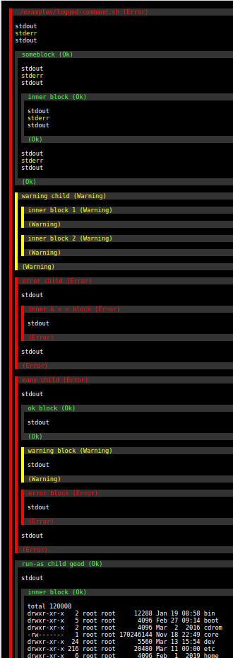
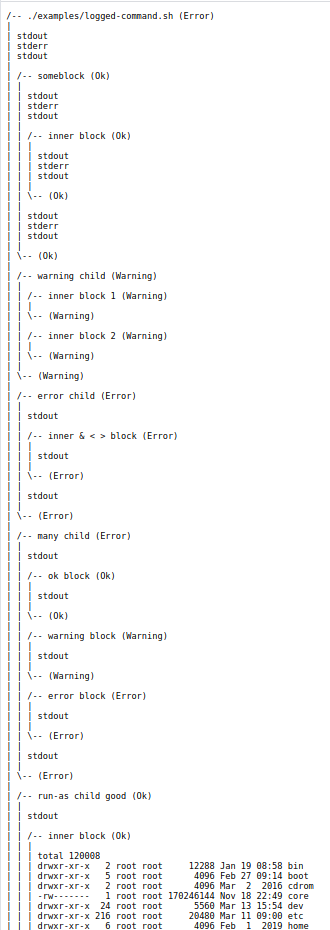

# Introduction

`nestedlog` is a utility to capture the `stdout`/`stderr` from a program or
script and generated a formatted log file. The logged script can communicate
with nestedlog to divide its output into blocks. The created block structure
will be easily visible in the generated log file. Each block also has an
associated status which will be represented in the log file. The overall
execution of the program is itself a block, and the status of this block is
automatically set based on the exit status of the program.

Logs may be generated in 1 or more of the following formats in parallel:

* HTML, with embedded CSS style sheet. This format is useful for viewing in a
web browser.
* HTML, with inline styles. This format is useful for use as the body of an
email. The layout works in at least:
  * Thunderbird on Linux.
  * K9-Mail on Android.
  * Gmail (web).
  * Gmail (Android app).
  * MS Exchange online a/k/a Office 365 (web).
  * MS Outlook on Windows.
* Plain-text. This format is useful for use as a fallback in multi-part MIME
email, or for recording plain-text logs that still represent the block
structure and status results.

A wrapper script is provided to run a command, generated HTML and plain-text
logs in parallel, combine the logs into a multi-part MIME email, and send the
email using `sendmail` or compatible mail-injection script.

# Example

The following images were generated from `examples/logged-command.sh`.

| HTML log | Plain Text Log |
| -------- | ----------- |
|  |  |

# Usage

Run a command and generate log files:

```shell
nestedlog log \
    --emit-html-inline xi.html \
    --emit-text x.txt \
    ./examples/logged-command.sh
```

Run a command, generate log files, compose a multi-part MIME email, and send
the results:

```shell
nestedlog-email \
    -f cron@example.com \
    -t sysadmin@example.com \
    -s "Nested log demo" \
    ./examples/logged-command.sh"
```

The requested command (e.g. `logged-command.sh` above) is run as a child of
`nestedlog`. While this child is running, it may invoke `nestedlog` to send
commands to the main instance, for example, to begin or end a block, or to
run a command and wrap that command's entire output in a new block. For
example:

```shell
nestedlog start-block "some child block name"
echo Text that will show up in the block
nestedlog end-block ok
```

```shell
nestedlog run-as-block "another chld block" /path/to/script.sh
```

# Internals

At a very high level, `nestedlog` simply runs the specified command and
captures `stdout` and `stderr` using pipes. However, this is done in an
advanced fashion that:

* Preserves the natural interleaving of the two output streams, in exactly
the same way as would occur if the script was run interactively within a
terminal emulator.

* Keeps the two streams separate, so that it is possible to highlight the
data from each stream in a different fashion in the log files.

To the best of my knowledge, it is not possible to perform both of these
actions _at the same time_ with other techniques.

To achieve this, `nestedlog` implements a [CUSE](https://github.com/libfuse/libfuse/)
(Character devices in USEr space) device, and connects the logged program's
`stdout` and `stderr` to separate open files implemented by this driver. Since
`stdout` is connected to a device and not a pipe, applications will typically
line-buffer their output just as they would if connected to a terminal. Since
separate pipes are used, `nestedlog` can tell which stream each piece of
output was emitted upon. Since writes to the CUSE device are synchronous,
`nestedlog` observes the writes in the same interleaving order that the
program made them, rather than being negatively affected by pipe buffering and
related event ordering. This logic is implemented by `nestedlog-helper`, which
then multiplexes all received data and sends it back to the main `nestedlog`
instance, where it is formatted and written to relevant log files.

While running, the `nestedlog` program may be used to send commands to the
main `nestedlog` instance that invoked the program. The main instance of
`nestedlog` creates a Unix domain socket and listens for connections from
client instances. The path to this socket is stored in the
`NESTED_LOG_CONTROL` environment variable. When `nestedlog` is run as a client
instance, it opens this socket and sends a command to the main instance. This
allows logged scripts to easily begin and end blocks within the log.
